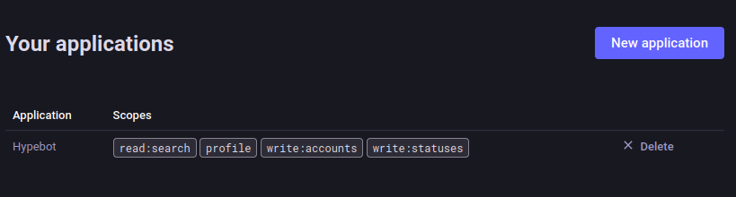
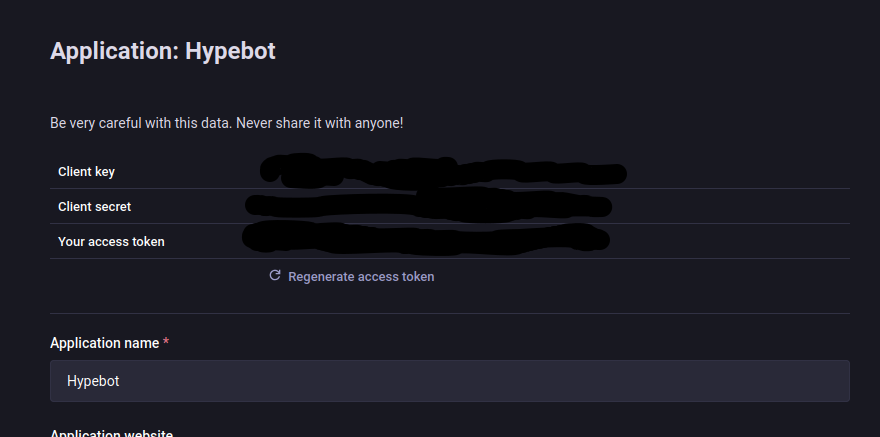

# Development of this fork has moved to [https://codeberg.org/tante/hypebot](https://codeberg.org/tante/hypebot)


# hype

This Mastodon bot transfers the trends from other instances directly to your personal timeline. You decide which instances it fetches and how much you want to see per instance. (Forked from Valentin Reiss' [https://github.com/v411e/hype](https://github.com/v411e/hype))

## Why

For smaller instances the local timeline is rather empty. This is why trends simply do not work on those instances: There is just not enough activity. Instead of manually checking out other instances this bot allows to subscribe to a multitude of different mastodon compatible servers to fetch trending posts and repost them to your current server helping discoverability of accounts, people and topics within the federated social web.

## Installation

Deploy with docker-compose

```yaml
version: "3"
services:
  hype:
    image: t4nte/hype:latest
    volumes:
      - ./config:/app/config
```

## Configuration

Create a `config.yaml` and a `auth.yaml` file in `./config/`. Enter the credentials of your bot-account into `auth.yaml`. You can define which servers to follow and how often to fetch new posts as well as how to automatically change your profile in config.yaml. See the examples below:

`auth.yaml`:

```yaml
# Credentials for your bot account
bot_account:
  server: "mastodon.example.com"
  email: "hypebot@example.com"
  client_id: "RANDOMSTRINGOFSTUFF"
  client_secret: "ANOTHERRANDOMSTRINGOFSTUFF"
  access_token: "EVENMORERANDOMSTUFF"
```

In order to auth against your Mastodon server using OAuth (which is the state-of-the-art way) you will need to set up an "application". Log into your bot account on your instance. Now head over to `Preferences`. In your `Preferences` menu select the `< > Development` menu item.

Now click `New application` as seen below (you can also see an example of a configured app there:



Fill in a name (something that will make you understand what the app is for. Maybe `Hypebot`?) and select the following scopes:

* read:search (we need that to look up the post to boost through your server)
* write:accounts (needed to set your bot's profile with the configured text)
* write:statuses (needed to be able to boost)

You could choose more rights for the app but the bot does not need them.

After creation the application is ready and at the top it will give you three strings you need to add to `auth.yml`:



* client_id
* client_secret
* access_token

Be aware that those three things together give anyone who has them the rights to do anything that the scopes you selected for the app allow.

`config.yaml`

```yaml
# Refresh interval in minutes
interval: 60

# Text to add to the bot profile befor the list of subscribed servers
profile_prefix: "I am boosting trending posts from:"

# profile fields to fill in
fields:
  code: https://github.com/tante/hype
  operator: "YOUR HANDLE HERE"

# Define subscribed instances and
# their individual limit (top n trending posts)
# which is again limited by the API to max 20
subscribed_instances:
  chaos.social:
    limit: 20
  mastodon.social:
    limit: 5
```

## Features

- Boost trending posts from other Mastodon instances
- configurable delay to spread out boosts a bit
- filter instances whose posts might have make it to a server you are watching but you don't want to give any support to
---
